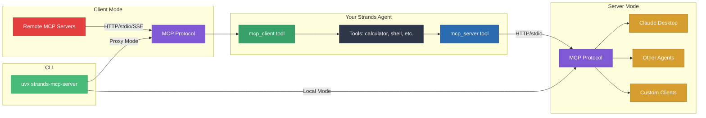

# strands-mcp-server

[](https://pypi.org/project/strands-mcp-server/)

[![Awesome Strands Agents](https://img.shields.io/badge/Awesome-Strands%20Agents-00FF77?style=flat-square&logo=data:image/svg+xml;base64,PHN2ZyB3aWR0aD0iMjkwIiBoZWlnaHQ9IjQ2MyIgdmlld0JveD0iMCAwIDI5MCA0NjMiIGZpbGw9Im5vbmUiIHhtbG5zPSJodHRwOi8vd3d3LnczLm9yZy8yMDAwL3N2ZyI+CjxwYXRoIGQ9Ik05Ny4yOTAyIDUyLjc4ODRDODUuMDY3NCA0OS4xNjY3IDcyLjIyMzQgNTYuMTM4OSA2OC42MDE3IDY4LjM2MTZDNjQuOTgwMSA4MC41ODQzIDcxLjk1MjQgOTMuNDI4MyA4NC4xNzQ5IDk3LjA1MDFMMjM1LjExNyAxMzkuNzc1QzI0NS4yMjMgMTQyLjc2OSAyNDYuMzU3IDE1Ni42MjggMjM2Ljg3NCAxNjEuMjI2TDMyLjU0NiAyNjAuMjkxQy0xNC45NDM5IDI4My4zMTYgLTkuMTYxMDcgMzUyLjc0IDQxLjQ4MzUgMzY3LjU5MUwxODkuNTUxIDQxMS4wMDlMMTkwLjEyNSA0MTEuMTY5QzIwMi4xODMgNDE0LjM3NiAyMTQuNjY1IDQwNy4zOTYgMjE4LjE5NiAzOTUuMzU1QzIyMS43ODQgMzgzLjEyMiAyMTQuNzc0IDM3MC4yOTYgMjAyLjU0MSAzNjYuNzA5TDU0LjQ3MzggMzIzLjI5MUM0NC4zNDQ3IDMyMC4zMjEgNDMuMTg3OSAzMDYuNDM2IDUyLjY4NTcgMzAxLjgzMUwyNTcuMDE0IDIwMi43NjZDMzA0LjQzMiAxNzkuNzc2IDI5OC43NTggMTEwLjQ4MyAyNDguMjMzIDk1LjUxMkw5Ny4yOTAyIDUyLjc4ODRaIiBmaWxsPSIjRkZGRkZGIi8+CjxwYXRoIGQ9Ik0yNTkuMTQ3IDAuOTgxODEyQzI3MS4zODkgLTIuNTc0OTggMjg0LjE5NyA0LjQ2NTcxIDI4Ny43NTQgMTYuNzA3NEMyOTEuMzExIDI4Ljk0OTIgMjg0LjI3IDQxLjc1NyAyNzIuMDI4IDQ1LjMxMzhMNzEuMTcyNyAxMDMuNjcxQzQwLjcxNDIgMTEyLjUyMSAzNy4xOTc2IDE1NC4yNjIgNjUuNzQ1OSAxNjguMDgzTDI0MS4zNDMgMjUzLjA5M0MzMDcuODcyIDI4NS4zMDIgMjk5Ljc5NCAzODIuNTQ2IDIyOC44NjIgNDAzLjMzNkwzMC40MDQxIDQ2MS41MDJDMTguMTcwNyA0NjUuMDg4IDUuMzQ3MDggNDU4LjA3OCAxLjc2MTUzIDQ0NS44NDRDLTEuODIzOSA0MzMuNjExIDUuMTg2MzcgNDIwLjc4NyAxNy40MTk3IDQxNy4yMDJMMjE1Ljg3OCAzNTkuMDM1QzI0Ni4yNzcgMzUwLjEyNSAyNDkuNzM5IDMwOC40NDkgMjIxLjIyNiAyOTQuNjQ1TDQ1LjYyOTcgMjA5LjYzNUMtMjAuOTgzNCAxNzcuMzg2IC0xMi43NzcyIDc5Ljk4OTMgNTguMjkyOCA1OS4zNDAyTDI1OS4xNDcgMC45ODE4MTJaIiBmaWxsPSIjRkZGRkZGIi8+Cjwvc3ZnPgo=&logoColor=white)](https://github.com/cagataycali/awesome-strands-agents)

Bidirectional MCP integration for Strands Agents.

```bash
pip install strands-mcp-server
```

<a href="https://glama.ai/mcp/servers/@cagataycali/strands-mcp-server">
  
</a>

---

## Overview

- **mcp_server** - Expose agent as MCP server
- **mcp_client** - Connect to MCP servers
- **CLI** - stdio for Claude Desktop



---

## Quick Start

**Server:**
```python
from strands import Agent
from strands_mcp_server import mcp_server

agent = Agent(tools=[..., mcp_server])
agent("start mcp server on port 8000")
```

**Client:**
```python
from strands import Agent
from strands_mcp_server import mcp_client

agent = Agent(tools=[mcp_client])
agent.tool.mcp_client(
    action="connect",
    connection_id="remote",
    transport="http",
    server_url="http://localhost:8000/mcp"
)
agent.tool.mcp_client(
    action="call_tool",
    connection_id="remote",
    tool_name="calculator",
    tool_args={"expression": "42 * 89"}
)
```

**For Agents like Claude Desktop/Kiro/...:**
```json
{
  "mcpServers": {
    "my-agent": {
      "command": "uvx",
      "args": ["strands-mcp-server", "--cwd", "/path/to/project"]
    }
  }
}
```

---

## API

### mcp_server

| Parameter | Default | Description |
|-----------|---------|-------------|
| `action` | required | `start`, `stop`, `status`, `list` |
| `transport` | `http` | `http` or `stdio` |
| `port` | 8000 | Port |
| `tools` | None | Tools to expose (None = all) |
| `expose_agent` | True | Include `invoke_agent` |
| `stateless` | False | Multi-node ready |

### mcp_client

| Parameter | Description |
|-----------|-------------|
| `action` | `connect`, `disconnect`, `list_tools`, `call_tool` |
| `connection_id` | Connection ID |
| `transport` | `http`, `stdio`, `sse` |
| `server_url` | Server URL |
| `tool_name` | Tool to call |
| `tool_args` | Tool arguments |

### invoke_agent

Full agent access when `expose_agent=True`:

```python
agent.tool.mcp_client(
    action="call_tool",
    connection_id="remote",
    tool_name="invoke_agent",
    tool_args={"prompt": "Calculate 2 + 2"}
)
```

---

## CLI

```bash
uvx strands-mcp-server [OPTIONS]
```

| Option | Description |
|--------|-------------|
| `--cwd PATH` | Working directory |
| `--upstream-url URL` | Upstream server (proxy) |
| `--system-prompt TEXT` | System prompt |
| `--no-agent-invocation` | Disable invoke_agent |
| `--debug` | Debug mode |

**Examples:**
```bash
# Local
uvx strands-mcp-server --cwd /path/to/project

# Proxy
uvx strands-mcp-server --upstream-url http://localhost:8000/mcp
```

---

## Troubleshooting

```bash
# Debug
uvx strands-mcp-server --cwd /path --debug

# Check connection
curl http://localhost:8000/mcp

# Port in use
lsof -i :8000 && kill -9 <PID>

# Claude logs
tail -f ~/Library/Logs/Claude/mcp*.log
```

---

## Links

- [Docs](https://cagataycali.github.io/strands-mcp-server/)
- [GitHub](https://github.com/cagataycali/strands-mcp-server)
- [PyPI](https://pypi.org/project/strands-mcp-server/)
- [Strands](https://strandsagents.com)
- [MCP](https://modelcontextprotocol.io/)

---

**License:** Apache 2.0